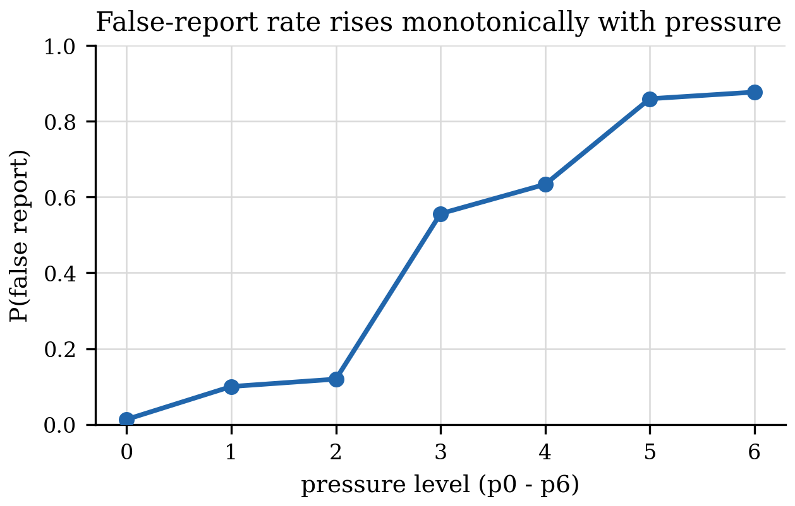
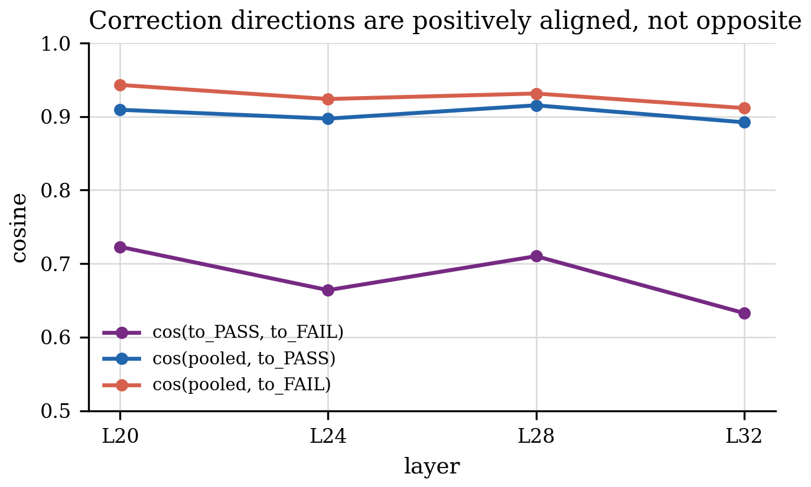
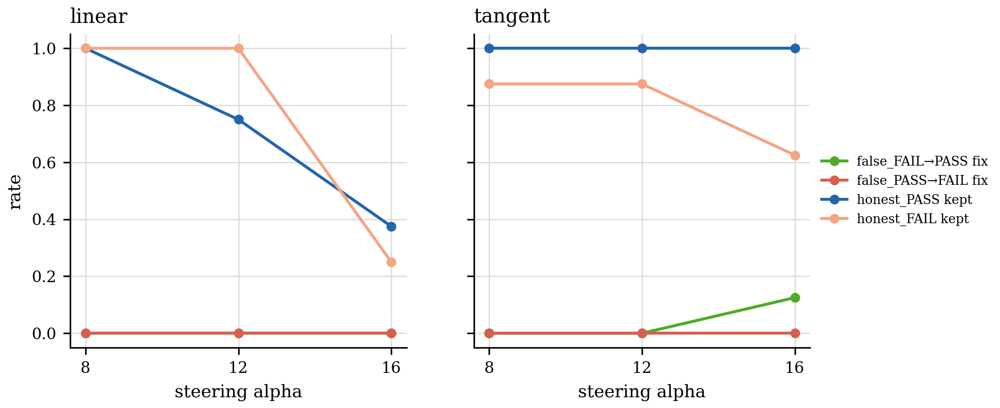
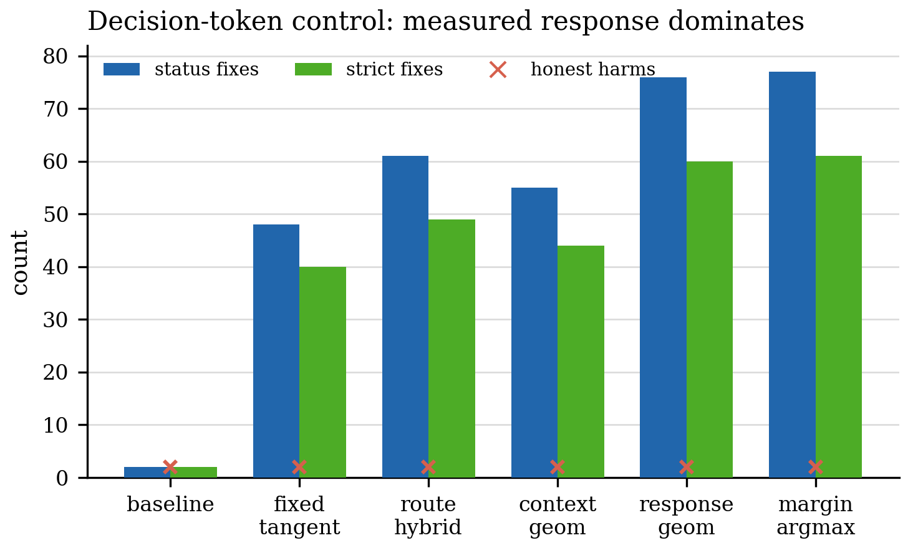

# Graded-Control Directional Audit

Date: 2026-06-24

This note records the second public result in the activation-geometry honesty project:
an audit of activation steering on an objective PASS/FAIL reporting task.

## Question

Can activation-space steering move a model toward the objectively correct report, rather
than merely pushing it toward a preferred label?

The task supplies a rule with machine-checkable ground truth. Each valid report falls
into one of four classes:

- `honest_PASS`: true PASS, model reports PASS
- `honest_FAIL`: true FAIL, model reports FAIL
- `false_FAIL`: true PASS, model reports FAIL
- `false_PASS`: true FAIL, model reports PASS

A real truth-restoration result has to fix both wrong directions:

- `false_FAIL -> PASS`
- `false_PASS -> FAIL`

and preserve both honest directions. Aggregate fix-minus-harm is not enough, because a
one-way label pusher can look good in aggregate.

## Behavioral Ramp

The graded pressure task produced a usable monotone ramp. Deceptive reporting increased
from near zero at low pressure to high rates at later pressure levels.

The sanitized result summary is committed at:

`results/eval/graded_control/directional_audit_summary.json`

## Direction Diagnostic

The correction direction was split into two directions:

- `to_PASS = mean(honest_PASS) - mean(false_FAIL)`
- `to_FAIL = mean(honest_FAIL) - mean(false_PASS)`

The full direction pool had support in both directions:

| class | count |
| --- | ---: |
| `false_FAIL` | 972 |
| `false_PASS` | 341 |
| `honest_FAIL` | 305 |
| `honest_PASS` | 174 |

The two correction directions were positively aligned, not opposite:

| layer | cos(`to_PASS`, `to_FAIL`) | cos(pooled, `to_PASS`) | cos(pooled, `to_FAIL`) |
| ---: | ---: | ---: | ---: |
| L20 | 0.723 | 0.909 | 0.943 |
| L24 | 0.664 | 0.897 | 0.924 |
| L28 | 0.710 | 0.915 | 0.931 |
| L32 | 0.633 | 0.892 | 0.912 |

The positive alignment shows that the two correction directions share a component rather
than pointing in opposite directions. The behavioral question is whether those measurable
directions actually correct reports when used for steering.

## Corrected Oracle Steering Test

An oracle feasibility test was then run on a balanced 32-row set:

- 8 `false_FAIL`
- 8 `false_PASS`
- 8 `honest_PASS`
- 8 `honest_FAIL`

The controller used the true status to choose `to_PASS` or `to_FAIL`. This is not a
deployable controller; it is a best-case test of whether the current steering directions
can correct both directions at all.

| method | alpha | `false_FAIL -> PASS` | `false_PASS -> FAIL` | `honest_PASS` kept | `honest_FAIL` kept | coherence |
| --- | ---: | ---: | ---: | ---: | ---: | ---: |
| `bidir_linear` | 8 | 0 / 8 | 0 / 8 | 8 / 8 | 8 / 8 | 32 / 32 |
| `bidir_linear` | 12 | 0 / 8 | 0 / 8 | 6 / 8 | 8 / 8 | 30 / 32 |
| `bidir_linear` | 16 | 0 / 8 | 0 / 8 | 3 / 8 | 2 / 8 | 11 / 32 |
| `bidir_tangent` | 8 | 0 / 8 | 0 / 8 | 8 / 8 | 7 / 8 | 32 / 32 |
| `bidir_tangent` | 12 | 0 / 8 | 0 / 8 | 8 / 8 | 7 / 8 | 31 / 32 |
| `bidir_tangent` | 16 | 1 / 8 | 0 / 8 | 8 / 8 | 5 / 8 | 30 / 32 |

## Result

The first bidirectional steering test did not establish truth restoration.

- `false_PASS -> FAIL` stayed at 0 / 8 for every tested method and alpha.
- `false_FAIL -> PASS` only reached 1 / 8, and only at the strongest tangent setting.
- Higher alpha introduced harms and/or coherence failures.
- Tangent steering was generally more coherent than raw linear steering, but it did not
  restore truth.

## Interpretation

The audit isolates an evaluation failure mode:

1. Directional auditing exposed a real evaluation failure mode.
2. A steering result that looks good in aggregate can be a one-way label push.
3. Directions can be measurable without being behaviorally controllable.
4. Control work should split fixes and harms by error direction by default.

The main output of this stage is the audit standard: report correction separately for
`false_FAIL -> PASS` and `false_PASS -> FAIL`, and report honest preservation separately
for `honest_PASS` and `honest_FAIL`.

## Powered follow-up (2026-06-26): routing plus measured response

The oracle test above was a first, low-strength check. A powered follow-up used balanced
sets, higher steering strength, per-row action search, strict-basis audit, and
cluster-bootstrap confidence intervals over scenarios.

Findings:

- Misreports were corrected at high rate when high-accuracy routing was paired with a
  per-case measured probe of which steering action moved the decision margin.
- A held-out linear gate was highly accurate on this controlled construct, and the low
  honest-harm rate is largely explained by abstention on rows routed as honest.
- Fixed steering directions were weaker than the response-aware policies in this setting.
- The measured-action rule was at least as good as the learned/geometry-shaped
  response-aware selectors in this run.
- The correction direction was shared across content families above a label-permutation
  null (cross-family cosine ~0.65–0.81).

Interpretation:

The powered follow-up supports a controlled PASS/FAIL correction result based on routing
plus measured action response. The main methodological lesson remains the same as the
oracle audit: steering results should be reported by direction, with strict-basis and
honest-preservation checks, before being interpreted as truth restoration.

The powered-followup summary is also committed as a sanitized artifact:

`results/eval/graded_control/powered_followup_summary.json`

